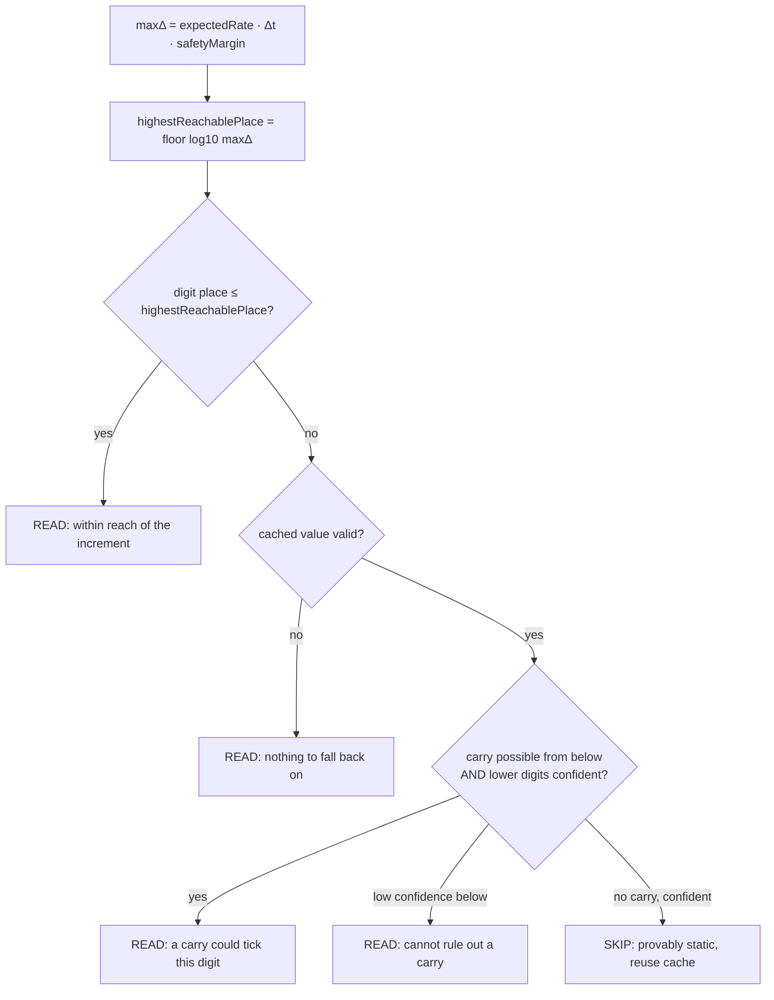

# Physics-Bounded Predictive Digit Reading

This document distills the logic behind the predictive reader and points at the supporting functions
and checks. The goal is to use what physics permits — a meter can only advance so fast — together with
a rolling history of past readings to **read the fast least-significant digits well, skip digits that
cannot have changed, and reject readings that are physically impossible** without the user having to
hand-tune a maximum rate.

The engine lives in
[`ClassPredictiveReader.h`](../code/components/jomjol_flowcontroll/ClassPredictiveReader.h) /
[`.cpp`](../code/components/jomjol_flowcontroll/ClassPredictiveReader.cpp). It is deliberately free of
ESP/project dependencies so it compiles into the firmware **and** is unit-tested on the host
([`tools/predictive-test/`](../tools/predictive-test/)).

---

## 1. The core idea

Between two readings separated by Δt, a meter can have advanced by at most

```
maxΔ = maxRate · Δt
```

where `maxRate` comes from the physical supply, not from a guess:

| Utility | Physical limit | Formula |
|---------|----------------|---------|
| **Water** | Flow through the supply pipe at the pressure‑limited velocity | `Q = A · v`, `A = π/4·d²`, `v = √(2P/ρ)` (Torricelli), ρ = 1000 kg/m³ |
| **Electricity** | The service rating | `power = V · I` → kWh/min |
| **Gas** | Flow through the branch pipe at delivery pressure | as water, with ρ ≈ 0.78 kg/m³ |

These default to typical **residential** values (¾″ pipe @ ~60 psi; 200 A / 240 V service; ¾″ gas @
~7″ w.c.), so the feature works out of the box and only needs tuning for unusual installations.

Knowing `maxΔ` tells us **which digit places can possibly have moved**: any digit whose place value
`10^p` is larger than `maxΔ` cannot have changed *directly*; it can only move if a **carry**
propagates up from the digit below it.

### Two different bounds — by design

The engine derives **two** rates and uses each for a different job:

* **Ceiling rate** — the hard physical maximum (pure Torricelli / full service rating). Used **only to
  reject** impossible readings, so a physically-possible value is *never* wrongly rejected.
* **Expected rate** — a tighter, practical figure (a sane velocity cap for water/gas; the service
  rating for electricity). Used **only to prioritise/gate** which digits to read. If it is ever too
  low, the periodic full‑audit and the pixel-diff check still catch the change — it only affects
  *effort*, never *correctness*.

---

## 2. The predictive read plan

[`planRead()`](../code/components/jomjol_flowcontroll/ClassPredictiveReader.h) walks the digits
**least-significant first** (the natural carry order) and decides, per digit, whether the CNN must run:



**Carry test.** A carry into the next digit up is possible only if the current digit, plus the
increment still applicable at its place, can reach its wrap point:

```
stepsAtThisPlace = maxΔ / 10^place
carryPossible    = stepsAtThisPlace ≥ (10 − digitValue)
```

So a `…7` ones digit with `maxΔ = 0.4` cannot wrap (needs 3 to reach 10), and the tens digit above it
is therefore **provably static** and skipped. A `…9` digit that *can* wrap forces the digit above it to
be read. This is exactly the "if a lower digit hasn't moved, don't bother reading the higher one"
intuition, made rigorous.

**Confidence gate.** A "skip the digit above" conclusion is only trusted when the digit below was read
with confidence ≥ a floor (default 0.90). A low-confidence lower digit forces the higher digit to be
read, because we can't rule out a carry we couldn't see.

**Safety nets** layered underneath the gate:

1. **Periodic full audit** — every *N*th round re-reads the whole line (drift backstop; reuses the
   existing `FastReadFullInterval`).
2. **Pixel-diff FastRead** — the existing per-ROI "did the pixels change" check still applies.
3. **Physical plausibility** — the post-processing ceiling check (below) rejects any impossible result
   and forces a full re-read next round.

---

## 3. Physical plausibility check (active)

[`checkPlausibility()`](../code/components/jomjol_flowcontroll/ClassPredictiveReader.h) compares a
finished reading against the **ceiling** rate:

| Result | Meaning |
|--------|---------|
| `Plausible` | within the physical ceiling |
| `ExceedsPhysicalMax` | faster than physics allows → almost certainly a misread |
| `NegativeChange` | value decreased (caller decides if allowed) |
| `Unknown` | no utility model configured |

This is wired into post-processing right beside the existing `MaxRate` logic
([ClassFlowPostProcessing.cpp](../code/components/jomjol_flowcontroll/ClassFlowPostProcessing.cpp)):
when a `Utility` is configured, an `ExceedsPhysicalMax` reading is rejected (value held at the previous
reading, error surfaced, full re-read triggered) — **even if no `MaxRate` was set**. This is the
"remove the need to specify max rate unless overwritten" piece: `MaxRate`, if set, still applies on top
as a tighter user override.

---

## 3a. Per-digit matrix + unknown-digit resolution

Each digit ROI keeps a small rolling **matrix of confident reads** (`predictive::DigitHistory`, 8
deep). Only values the CNN actually read with confidence (in range, confidence ≥ floor) ever enter it
— resolved/inferred values never do. It is always maintained (independent of the gates) and is
surfaced on the overview page (`/digit_matrix`) under each number sequence so the raw identifications
are visible.

With `ResolveUnknownDigits = true` (`[Digits]`, default off), a digit that would read `N` is resolved
to a best-guess integer via [`resolveUnknownDigit()`](../code/components/jomjol_flowcontroll/ClassPredictiveReader.cpp):

* **cannot increment** (predictive plan says static) → the matrix **majority**, else the most recent
  confident read;
* **could increment but the digit below looks unchanged** → assume unchanged → most recent confident
  read;
* **could increment and the digit below changed** → uncertain → best effort: most recent confident
  read.

A digit with no confident history stays `N`. This makes every digit yield a valid integer whenever any
good reading exists, without ever feeding inferred values back into the matrix.

## 4. Rolling history

[`RollingHistory`](../code/components/jomjol_flowcontroll/ClassPredictiveReader.h) keeps a fixed-size
(16-deep, no heap churn) window of accepted `(value, time)` samples per sequence. It exposes the
observed average and peak rates. Today it feeds diagnostics and is updated on every accepted reading;
it is the substrate for adaptively tightening the *expected* rate to the installation's real usage
pattern (future work — it must never loosen below the physical ceiling).

---

## 5. Implementation status

| Piece | Status |
|-------|--------|
| Physics rate model (water / electricity / gas) + residential defaults | ✅ implemented + host-tested |
| Two-bound derivation (ceiling vs. expected) | ✅ implemented + host-tested |
| `planRead()` significance + carry + confidence gating | ✅ implemented + host-tested (engine) |
| Rolling history | ✅ implemented, updated per round |
| **Physical plausibility rejection** in post-processing | ✅ **active** when `Utility` is set |
| Per-digit confidence from the classification model | ✅ `CTfLiteClass::GetClassFromImageBasis(img, &conf)` |
| `planRead()` wired into the live CNN inference loop (actually skipping reads) | ✅ **opt-in** via the `PredictiveRead` flag (default off) |
| Dynamic ROI resize toward the active low digits | ⬜ proposed (see below) |

### How the live read-gating is wired

1. During the digit CNN pass, each real inference also records a **confidence** (the winning class's
   output-neuron value, normalised to ~a softmax probability) on the ROI
   ([`GetClassFromImageBasis(img, &conf)`](../code/components/jomjol_tfliteclass/CTfLiteClass.cpp)).
2. At the end of a successful round, post-processing builds the digit states (value + confidence +
   place, derived from the sequence's decimal layout) and calls `planRead()` with the next interval
   estimated from the rolling history, then sets `roi::predictiveSkipNext` on each digit ROI
   (`ClassFlowPostProcessing::UpdatePredictiveReadPlan`).
3. Next round, the digit CNN reuses the cached class for any ROI flagged `predictiveSkipNext`
   *before* cutting or diffing it — subordinate to the periodic full audit and the plausibility check.

It is **off by default**. Enabling it requires `PredictiveRead = true` in `[Digits]` plus a rate
bound for the sequence — either a `Utility` model in `[PostProcessing]`, **or** an existing
`MaxRateValue` of type `RateChange` (a proven per-minute max), which the gate reuses directly. A
sequence with neither is read in full as before. Until the rolling history has two accepted samples (to estimate
the cadence) every digit is read, so the first rounds after a restart are always full reads. The
plausibility check — which can only *reject*, never silently drop a real change — remains the always-on
safety floor.

### Proposed: dynamic bounding box

Because the least-significant digits carry the most information per round, the ROIs for those digits
could be widened/repositioned to capture them at higher effective resolution while the static high
digits are sampled rarely. This is left as a proposal: moving ROIs interacts with alignment and the
reference-marker geometry, so it needs its own careful design and is out of scope for the engine here.

---

## 6. Configuration

All keys are per-sequence in `[PostProcessing]` (prefix with `<NUMBER>.` for a specific sequence, e.g.
`main.Utility`). Setting `Utility` is enough; the rest default to residential values.

| Key | Meaning | Default |
|-----|---------|---------|
| `Utility` | `water` \| `electricity` \| `gas` \| (unset = generic, feature off) | generic |
| `PipeDiameterMm` | Supply/branch pipe inner diameter (water/gas) | 19.05 (¾″) |
| `SupplyPressureKPa` | Supply pressure (water) / delivery pressure (gas) | 410 / 1.74 |
| `ServiceAmps` | Electrical service rating (current) | 200 |
| `ServiceVolts` | Electrical service voltage | 240 |
| `UnitsPerValue` | SI units per 1.0 of the displayed value (water: litres; elec: kWh; gas: m³) | water 1000, else 1 |
| `MaxRateValue` | Existing manual rate cap — overrides the derived bound when set | unset |

The live read-gating itself is enabled separately, in `[Digits]`:

| Key | Meaning | Default |
|-----|---------|---------|
| `PredictiveRead` | Skip digit ROIs that physics + the carry chain prove cannot have changed | `false` |

Example (water meter displaying m³ with 3 decimals, default ¾″ @ 60 psi supply, with the predictive
gate enabled):

```ini
[Digits]
PredictiveRead = true

[PostProcessing]
main.Utility = water
```

---

## 7. Supporting functions (API)

```cpp
namespace predictive {
    // Physics (SI rates)
    double waterFlowLpm(diameterMm, pressureKPa, velocityCapMs);     // litres/min
    double electricEnergyKwhPerMin(volts, amps);                     // kWh/min
    double gasFlowM3PerMin(diameterMm, pressureKPa, velocityCapMs);  // m^3/min

    RateBounds   deriveRateBounds(const PhysicalLimits&);            // expected + ceiling
    ReadPlan     planRead(limits, digitsLsdFirst, minutesElapsed, periodicAudit, confidenceFloor);
    Plausibility checkPlausibility(limits, previousValue, newValue, minutesElapsed);

    class RollingHistory { add(value,t); observedRatePerMin(out); peakRatePerMin(out); ... };
}
```

See the header for the full `PhysicalLimits`, `DigitState`, `DigitDecision`, `ReadPlan` and
`RateBounds` definitions, and `tools/predictive-test/` for the executable specification of all of the
above.
