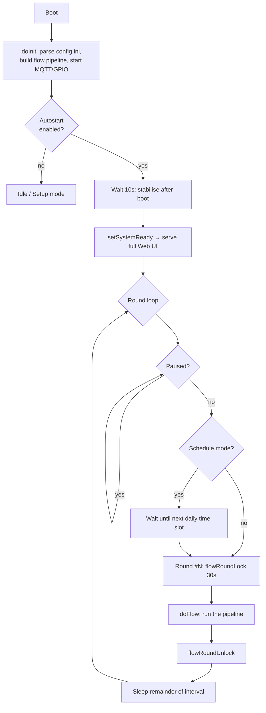
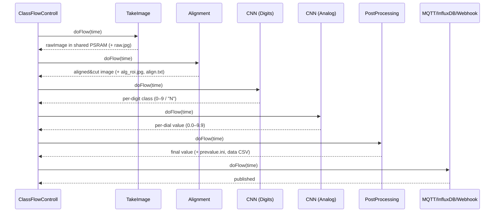
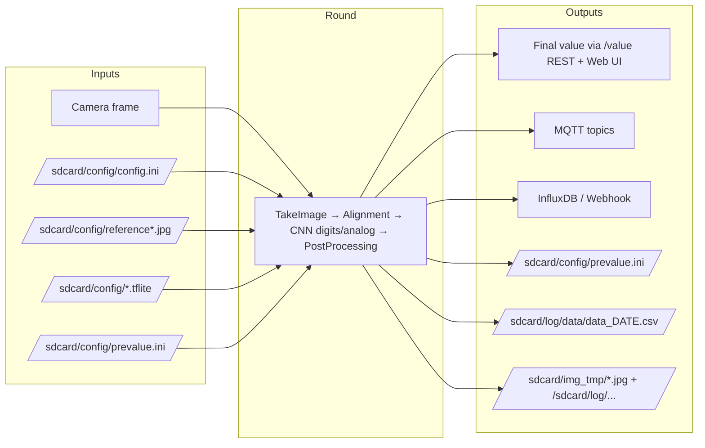

# Process Flow — Digitizing an Analog/Mechanical Meter

This page documents what the firmware actually does on **each processing round**: the functions that
are called, the inputs they consume, the files they read and write, and the outputs they produce. It
focuses on the program's core purpose — turning a camera image of a water/gas/electricity meter into a
trustworthy numeric reading and publishing it.

All paths below are on the device filesystem mounted at `/sdcard` (a physical SD card on the
ESP32‑CAM/WROVER, or the in‑flash LittleFS partition on the ESP32‑S3). Source references point at
`code/components/jomjol_flowcontroll/`.

---

## 1. The big picture

A single FreeRTOS task drives everything. Once per round it runs an ordered **pipeline of flow steps**;
each step transforms a shared in‑memory image and hands off to the next. The final value is persisted,
logged, and pushed to the configured sinks.



* **Scheduler / task:** [`task_autodoFlow()`](../code/components/jomjol_flowcontroll/MainFlowControl.cpp#L1916)
* **Round entry:** [`doflow()`](../code/components/jomjol_flowcontroll/MainFlowControl.cpp#L215) → [`ClassFlowControll::doFlow()`](../code/components/jomjol_flowcontroll/ClassFlowControll.cpp#L511)
* **Re‑entrancy guard:** a per‑round mutex (`flowRoundLock`) serialises the camera + shared PSRAM
  region against web‑editor actions (test capture, reference image, ROI edits) so they never collide.

### Boot‑time specials

| Condition | Behaviour |
|-----------|-----------|
| Last reset was a panic (and not a planned reboot) | Wait **5 minutes** before the first round, leaving a window to OTA‑update or pull logs ([MainFlowControl.cpp:1922](../code/components/jomjol_flowcontroll/MainFlowControl.cpp#L1922)). |
| Normal autostart | Wait **10 s** to let Wi‑Fi associate, the camera warm up, and power settle ([:1949](../code/components/jomjol_flowcontroll/MainFlowControl.cpp#L1949)). |
| Setup mode active | Do not autostart; the UI drives capture/reference manually. |

### Round cadence

* **Interval mode** — after a round finishes, sleep `interval − round_duration` so the *cadence* is
  honoured regardless of how long the round took ([:2120](../code/components/jomjol_flowcontroll/MainFlowControl.cpp#L2120)).
* **Schedule mode** — instead of a fixed interval, wait until the next configured wall‑clock slot
  (requires NTP time) ([:1986](../code/components/jomjol_flowcontroll/MainFlowControl.cpp#L1986)).
* The interval is **re‑read every round**, so a change via `/reload_config` takes effect next round
  without a reboot.

---

## 2. How the pipeline is built

At init, [`InitFlow()`](../code/components/jomjol_flowcontroll/ClassFlowControll.cpp#L403) reads
`/sdcard/config/config.ini` top to bottom. Each `[Section]` header is turned into a flow‑step object by
[`CreateClassFlow()`](../code/components/jomjol_flowcontroll/ClassFlowControll.cpp#L277) and appended to
the ordered `FlowControll[]` vector. Each object then parses its own keys via `ReadParameter()`.

| config.ini section | Flow‑step class | Role |
|--------------------|-----------------|------|
| `[TakeImage]`   | `ClassFlowTakeImage`     | Capture a frame |
| `[Alignment]`   | `ClassFlowAlignment`     | De‑rotate/cut to a stable frame |
| `[Digits]`      | `ClassFlowCNNGeneral` (digit) | Cut digit ROIs + classify |
| `[Analog]`      | `ClassFlowCNNGeneral` (analog) | Cut dial ROIs + read angle |
| `[PostProcessing]` | `ClassFlowPostProcessing` | Assemble + validate the number |
| `[MQTT]`        | `ClassFlowMQTT`          | Publish to MQTT |
| `[InfluxDB]` / `[InfluxDBv2]` | `ClassFlowInfluxDB(v2)` | Write to InfluxDB |
| `[Webhook]`     | `ClassFlowWebhook`       | HTTP POST JSON |

The steps execute **in the order they appear in `config.ini`** (the table above is the normal order).
After parsing, if alignment cropping is enabled, the ROI coordinates of the digit/analog steps are
shifted into crop space so the cuts line up with the cropped frame.

---

## 3. Round execution — the step driver

[`ClassFlowControll::doFlow(time)`](../code/components/jomjol_flowcontroll/ClassFlowControll.cpp#L511)
walks `FlowControll[]` and calls each step's `doFlow(time)`. Around every step it:

1. Sets the human‑readable status (`/statusflow` REST + `<topic>/status` MQTT) and the **status LED**
   stage (`PROC_STAGE_TAKEIMAGE`, `…_ALIGN`, `…_DIGITIZE`, `…_POSTPROC`, `…_TRANSMIT`).
2. Records per‑step **duration + heap/PSRAM delta** at DEBUG level (`Diag:` log lines).
3. Applies the **failure policy** (below).



### Failure policy

| Failing step | Action |
|--------------|--------|
| `ClassFlowTakeImage` or `ClassFlowAlignment` | **Graceful skip:** set an error status (REST + MQTT `…/error` for the Home Assistant "problem" sensor) and end the round *without rebooting*. These soft failures (PSRAM region too small to decode; regenerable `align.txt` cache unreadable) self‑heal next round. A genuinely wedged camera already reboots inside `CaptureToBasisImage`. ([ClassFlowControll.cpp:572](../code/components/jomjol_flowcontroll/ClassFlowControll.cpp#L572)) |
| Any other step | Decrement `i` and **retry the previous step**; after **5** failed retries, `doReboot()`. |

---

## 4. Step‑by‑step detail

### 4.1 Take Image — `ClassFlowTakeImage::doFlow` ([:558](../code/components/jomjol_flowcontroll/ClassFlowTakeImage.cpp#L558))

| | |
|---|---|
| **Calls** | `psram_init_shared_memory_for_take_image_step()` → `CreateLogFolder()` → `takePictureWithFlash(flash_duration)` → `LogImage("raw", …)` → `RemoveOldLogs()` → `psram_deinit_shared_memory_for_take_image_step()` |
| **Inputs** | Camera sensor; camera settings from `CCstatus` (brightness/contrast/quality/zoom/flip); `[TakeImage]` config (`WaitBeforePicture`, LED intensity, frame size). If a new reference image changed the sensor, settings are re‑applied first. |
| **Writes** | `rawImage` (a `CImageBasis`) into the **shared PSRAM region**; `/sdcard/img_tmp/raw.jpg`; if image logging is on, the raw JPG under `/sdcard/log/source/<date>/<hour>/`. |
| **Output** | The raw frame, in memory, for the rest of the pipeline. |
| **Failure** | Returns `false` if the decode failed because the shared region was too small (→ graceful skip). The shared region is released either way. |

The camera image is decoded into a region of PSRAM that is **time‑multiplexed**: the same region later
holds the tflite model + tensor arena, which is why the model is (re)loaded per round rather than kept
resident.

### 4.2 Alignment — `ClassFlowAlignment::doFlow` ([:280](../code/components/jomjol_flowcontroll/ClassFlowAlignment.cpp#L280))

| | |
|---|---|
| **Calls** | `ApplyMaskAndCrop()` (if masks/crop) → build `ImageTMP` + `CAlignAndCutImage` from `rawImage` → `CRotateImage` (initial flip/rotate) → `Align()` **or** `AlignByTransform()` → `DrawRef()` + `DigitDrawROI()` + `AnalogDrawROI()`. |
| **Inputs** | `rawImage`; reference‑marker images and target positions from `[Alignment]` config; `initialrotate`, `initialflip`, crop/mask settings; the cached transform from `align.txt`. |
| **Writes** | The aligned/cut frame into shared memory; `/sdcard/img_tmp/alg_roi.jpg` (the **overview thumbnail** with ROI/markers drawn); the `align.txt` cache (regenerable). With *SaveAllFiles*: also `rot.jpg`, `alg.jpg`. |
| **Output** | A de‑rotated, cropped, stable frame so every ROI lands on the same pixels each round. |
| **Optimisation** | **Periodic alignment** — the expensive full marker search runs only every *N*th round; in between, the cached transform is re‑applied (framing is stable between captures). |
| **Failure** | If reference markers are missing/corrupt, alignment is skipped best‑effort (ROIs read off the rotated raw image) rather than crashing. Only an unreadable `align.txt` reports a (graceful‑skip) failure. |

### 4.3 Digitize — `ClassFlowCNNGeneral::doFlow` ([:562](../code/components/jomjol_flowcontroll/ClassFlowCNNGeneral.cpp#L562))

Runs once for the **digit** ROIs and once for the **analog** ROIs. Two phases:

**(a) Cut ROIs — `doAlignAndCut()` ([:604](../code/components/jomjol_flowcontroll/ClassFlowCNNGeneral.cpp#L604))**

| | |
|---|---|
| **Calls** | For every number → every ROI: `CutAndSave(posx,posy,deltax,deltay)` then `Resize(modelxsize, modelysize)` to the model's input size. |
| **Inputs** | The aligned frame (`GetAlignAndCutImage()`); ROI rectangles from `[Digits]`/`[Analog]` config. |
| **Writes** | With *SaveAllFiles*: each ROI crop to `/sdcard/img_tmp/<roi>.jpg`. |
| **Output** | A model‑sized image buffer per ROI (`ROI[i]->image`). |

**(b) Inference — `doNeuralNetwork()` ([:738](../code/components/jomjol_flowcontroll/ClassFlowCNNGeneral.cpp#L738))**

| | |
|---|---|
| **Calls** | `new CTfLiteClass` → `LoadModel("/sdcard"+cnnmodelfile)` → `MakeAllocate()` → per ROI: `LoadInputImageBasis()` → `Invoke()` → read outputs → `delete tflite`. |
| **Inputs** | The per‑ROI images; the `.tflite` model named in config (e.g. `/config/dig-class100-…tflite`, `/config/ana-cont-…tflite`). |
| **Computation** | **Analog dial:** two network outputs `f1,f2` → angle `atan2(f1,f2)` → value `0.0–10.0` (respecting CCW). **Digit:** `GetClassFromImageBasis()` → class `0–9`, or `10`/`11` meaning "not determined" (`N`). Results stored as `ROI[i]->result_float` / `result_klasse`. |
| **Writes** | If image logging is on, each ROI crop (filename prefixed with its result) to `/sdcard/log/analog/…` or `/sdcard/log/digit/…`. |
| **Output** | The raw per‑ROI readings consumed by post‑processing. |
| **Optimisation** | **FastRead** (digits) — ROIs whose crop is unchanged since last round reuse the cached class and skip `Invoke()`; a full validation pass runs every `FastReadFullInterval` rounds, or when forced by a carry/consistency trigger. |

### 4.4 Post‑process — `ClassFlowPostProcessing::doFlow` ([:785](../code/components/jomjol_flowcontroll/ClassFlowPostProcessing.cpp#L785))

This step turns raw per‑ROI readings into the **trustworthy meter value** and is where most of the
"don't believe a bad frame" logic lives.

| | |
|---|---|
| **Calls** | Per number: `flowAnalog->getReadout()` / `flowDigit->getReadout()` → assemble `ReturnRawValue` → `UpdateNachkommaDecimalShift()` → digit‑transition/"N" handling → `checkDigitConsistency()` → `handleAllowNegativeRate()` / `MaxRate` guards → confidence‑vote → `SavePreValue()` → `WriteDataLog()`. |
| **Inputs** | Per‑ROI `result_float`/`result_klasse`; the image timestamp; the last good value + timestamp from `prevalue.ini`; `[PostProcessing]` config (decimals, `MaxRate*`, `AllowNegativeRates`, `ChangeRateThreshold`, `ConfidenceVotes`, extended resolution, etc.). |
| **Reads** | `/sdcard/config/prevalue.ini` (the persisted last reading — survives reboots). |
| **Writes** | `/sdcard/config/prevalue.ini` (new last value) and a row in `/sdcard/log/data/data_<date>.csv`. |
| **Outputs (per number)** | `ReturnValue` (final), `ReturnRawValue` (pre‑validation), `ReturnPreValue`, `ReturnRateValue`, `ReturnChangeAbsolute`, `ErrorMessageText`. |

**Validation / plausibility logic applied here:**

* **Decimal shift** and analog↔digit transition handling assemble the digits in the right places.
* **"N" (undetermined) replacement** fills digits the network couldn't read.
* **Digit‑increase consistency check** (`CheckDigitIncreaseConsistency`) — reconstructs misread higher
  digits from the previous reading using the meter's carry rule (see below).
* **Rate guards** (`MaxRateValue`/`MaxRateType`, `AllowNegativeRates`) bound the per‑interval change
  and decide whether a decrease is acceptable.
* **Confidence vote** — a single spurious *high* read no longer sticks: enough subsequent rounds
  agreeing on a lower value override it.

#### Digit‑increase consistency check

`CheckDigitIncreaseConsistency` is a per‑number `[PostProcessing]` option (default `false`, Expert
parameter). When enabled, [`checkDigitConsistency()`](../code/components/jomjol_flowcontroll/ClassFlowPostProcessing.cpp#L1170)
runs at [ClassFlowPostProcessing.cpp:903](../code/components/jomjol_flowcontroll/ClassFlowPostProcessing.cpp#L903)
and **repairs the higher digits** of the new reading using the physical rule a rolling meter always
obeys: *a digit wheel only advances when the wheel below it rolls past 9 → 0 (a carry).*

Walking from the lowest "rollable" digit upward, for each position it compares the new raw value
against the stored `PreValue` and checks whether the digit **below** wrapped (a zero crossing /
*Nulldurchgang*) since the last round:

| Did the wheel below wrap? | Expected for this digit | Correction if the CNN disagrees |
|---|---|---|
| **No** | unchanged | force it back to the previous reading's digit ([:1206](../code/components/jomjol_flowcontroll/ClassFlowPostProcessing.cpp#L1206)) |
| **Yes** | incremented by exactly 1 | add 1 ([:1212](../code/components/jomjol_flowcontroll/ClassFlowPostProcessing.cpp#L1212)) |

If the number has **no analog dials**, the scan starts one digit higher (`pot++`), because without an
analog wheel the lowest digit's sub‑position can't be trusted to judge a transition
([:1180](../code/components/jomjol_flowcontroll/ClassFlowPostProcessing.cpp#L1180)).

**Example** — previous `1299`, meter rolling over to `1300`, with the tens wheel caught mid‑roll and
misread as `9`:

| Wheel | PreValue | Raw CNN read | Wrap below? | Corrected |
|-------|----------|--------------|-------------|-----------|
| ones | 9 | 0 | — | 0 |
| tens | 9 | 9 *(mid‑roll misread)* | yes | **0** (carry up) |
| hundreds | 2 | 2 | yes | **3** |
| thousands | 1 | 1 | no | 1 |

→ a raw `1299`/`1290` is corrected to `1300` instead of being accepted as a wrong/backwards value.

> **Caveat:** this *trusts `PreValue` as ground truth* and assumes the meter only counts up — a stale
> or wrong `PreValue` (or a meter that legitimately decreased) can propagate an error, which is why it
> is off by default and pairs with the `AllowNegativeRates` / `MaxRate*` guards that run just after it.
> It is distinct from the confidence‑vote logic, which overrides a stuck spurious *high* read across
> several rounds rather than reconstructing digits within one round.

**Data‑log CSV columns** ([`WriteDataLog`](../code/components/jomjol_flowcontroll/ClassFlowPostProcessing.cpp#L1054) → `LogFile.WriteToData`):

```
timestamp ; number_name ; RawValue ; Value ; PreValue ; RateValue ; ChangeAbsolute ; ErrorMessage ; digit_raw ; analog_raw
```

### 4.5 Publish — MQTT / InfluxDB / Webhook

Each configured sink reads the finished values off the post‑processing step and transmits them.

| Step | Inputs | Output |
|------|--------|--------|
| `ClassFlowMQTT` | Per‑number `ReturnValue`/raw/rate/error, plus device telemetry | Publishes `<maintopic>/<number>/value`, `…/raw`, `…/rate`, `…/error`, `…/timestamp`, etc. (TLS via the built‑in CA bundle when `mqtts://`). |
| `ClassFlowInfluxDB` / `…v2` | Per‑number value + timestamp | Writes a measurement point (v1 line protocol, or v2 `/api/v2/write` with org/bucket/token). |
| `ClassFlowWebhook` | Per‑number value/JSON | HTTP(S) POST to the configured URL. |

A **skipped round** (graceful failure) simply omits these — MQTT republishes "no error" on the next
good round, and InfluxDB shows a gap rather than a bad point.

---

## 5. Inputs, outputs and files at a glance



### Filesystem map

| Path | Read/Write | Purpose |
|------|-----------|---------|
| `/sdcard/config/config.ini` | R | All settings; defines the pipeline. |
| `/sdcard/config/reference*.jpg` | R | Alignment reference‑marker images. |
| `/sdcard/config/*.tflite` | R | The CNN models (digit + analog). |
| `/sdcard/config/prevalue.ini` | R/W | Last good value per number (reboot‑persistent). |
| `/sdcard/config/align.txt` | R/W | Cached alignment transform (regenerable). |
| `/sdcard/img_tmp/raw.jpg` | W | Latest raw capture (UI/debug). |
| `/sdcard/img_tmp/alg_roi.jpg` | W | Aligned frame with ROIs/markers drawn — the overview thumbnail. |
| `/sdcard/img_tmp/<roi>.jpg` | W | Per‑ROI crops (when *SaveAllFiles*). |
| `/sdcard/log/source/<date>/<hour>/` | W | Archived raw frames (when image logging on). |
| `/sdcard/log/digit/`, `/sdcard/log/analog/` | W | Archived ROI crops tagged with their result. |
| `/sdcard/log/data/data_<date>.csv` | W | The reading history (one row per number per round). |
| `/sdcard/log/message/log_<date>.txt` | W | The device message log. |

### Key in‑memory state

| Object | Meaning |
|--------|---------|
| `CCstatus` / `CFstatus` | Live vs. config camera‑sensor settings. |
| `rawImage` (`CImageBasis`) | The decoded frame in the shared PSRAM region. |
| `AlignAndCutImage` | The aligned/cut working image. |
| `GENERAL[n]->ROI[i]` | One region of interest: its rectangle, cut image, and `result_float`/`result_klasse`. |
| `NUMBERS[j]` | One logical meter reading: assembled value, pre‑value, rate, error text. |

---

## 6. End‑to‑end summary (one round)

1. **Wake** on schedule, take the round mutex.
2. **Capture** a frame → `rawImage` (+ `raw.jpg`).
3. **Align** to a stable frame using reference markers → aligned image (+ `alg_roi.jpg`).
4. **Cut** each ROI and **run the CNN**: analog dials → angle→value, digits → class.
5. **Post‑process**: assemble digits, apply decimal/"N"/consistency/rate/confidence logic → final value.
6. **Persist** `prevalue.ini` + append a row to the data CSV.
7. **Publish** to MQTT / InfluxDB / Webhook and expose via the `/value` REST API and Web UI.
8. **Release** the mutex and sleep until the next round.

If a step fails, the round either **retries** (and reboots after 5 failures) or — for the camera and
alignment soft failures — **skips gracefully** and tries again next round, so a single bad frame never
corrupts the stored reading or boot‑loops the device.
